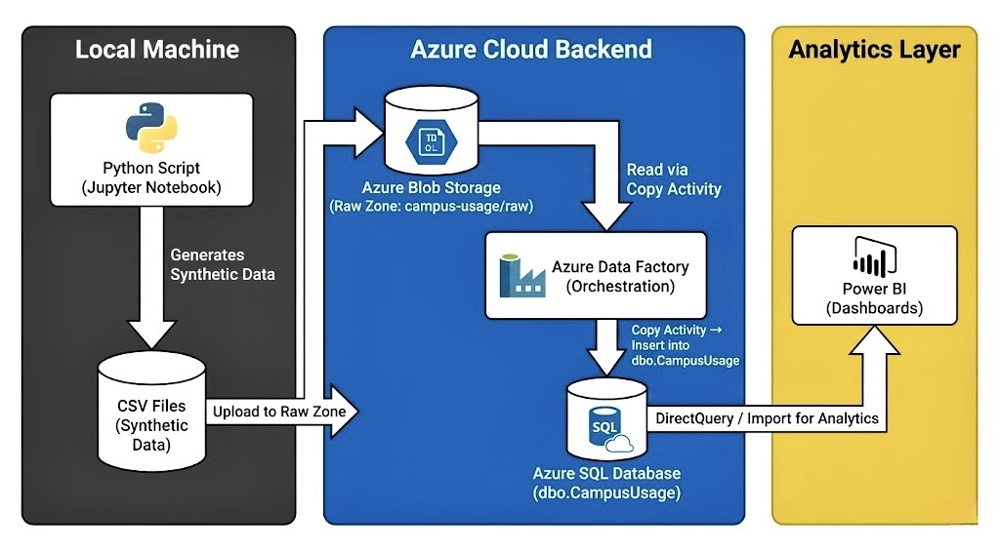

---

# 🟣 McMaster Campus Resource Usage Pipeline  
### End-to-End Azure Data Engineering Project  
Python • Azure Blob Storage • Azure Data Factory • Azure SQL • Power BI

This project simulates and analyzes **campus resource usage patterns at McMaster University** using a fully implemented cloud-based data engineering pipeline.  
It demonstrates practical skills in **data generation, ingestion, orchestration, transformation, storage, and reporting**, core competencies in modern data engineering.

---

# 📌 **Project Overview**

Students access various campus buildings daily (libraries, gym, study spaces, labs). This project models that behaviour by generating **synthetic usage logs** and processing them through an Azure pipeline.

The final output is a **Power BI dashboard** that displays:

* Most used campus buildings
* Resource type distribution
* Daily and weekly usage trends
* Peak activity hours
* Interactive building-level filtering

---

# 🧱 **Tech Stack**

### **Data Generation**

* Python
* Jupyter Notebook
* Pandas & NumPy

### **Cloud Services (Azure)**

* **Azure Blob Storage** (Raw zone)
* **Azure Data Factory** (Copy Activity + orchestration)
* **Azure SQL Database** (Structured storage)

### **Analytics**

* **Power BI Desktop** (Dashboards & reporting)

---

# 🗂️ **Architecture Diagram**

> **Full data flow: Local Machine → Azure Cloud Backend → Analytics Layer**



---

# 🧪 **1. Synthetic Data Generation (Python)**

A Python script generates realistic campus usage logs for ~60 days, simulating student check-in patterns across buildings such as:

* Mills Library
* Thode Library
* DBAC
* PGCLL
* ITB
* JHE

Each record includes:

| Column           | Description                                         |
| ---------------- | --------------------------------------------------- |
| usage_date       | Date of check-in                                    |
| usage_time       | Time of check-in                                    |
| student_id       | Synthetic student identifier                        |
| resource_type    | Library / Gym / StudyRoom / ComputerLab / Cafeteria |
| building_name    | Campus building accessed                            |
| duration_minutes | Session duration                                    |
| checkin_method   | CardSwipe / MobileApp / FrontDesk                   |
| is_peak_time     | Boolean for specific time windows                   |

Generated CSVs are saved to:

```
data/raw/
```

---

# 💾 **2. Azure Blob Storage — Raw Zone**

The synthetic CSV files are uploaded to an Azure Blob Storage container:

```
campus-usage/raw/
```
Blob Storage acts as the **landing zone** for raw structured data.

---

# 🔄 **3. Azure Data Factory — Orchestration Pipeline**

A single Copy Activity pipeline performs:

1. **Reads all CSVs** from Blob Storage (wildcard import)
2. **Maps raw columns to SQL table schema**
3. **Loads records into Azure SQL Database**

Pipeline components:

* Linked Services (Blob, SQL)
* Datasets (DelimitedText, SQL table)
* Copy Activity with column mapping

---

# 🗄️ **4. Azure SQL Database — Structured Storage**

A dedicated SQL table stores the clean, queryable dataset:

```sql
CREATE TABLE dbo.CampusUsage (
    id INT IDENTITY(1,1) PRIMARY KEY,
    usage_date DATE,
    usage_time TIME,
    student_id NVARCHAR(10),
    resource_type NVARCHAR(50),
    building_name NVARCHAR(100),
    duration_minutes INT,
    checkin_method NVARCHAR(50),
    is_peak_time BIT
);
```
ADF inserts all processed records directly into this table.

---

# 📊 **5. Power BI Dashboard**

Power BI connects to Azure SQL using **DirectQuery or Import mode**.

### Dashboard Features:

* **Bar Chart**: Most used buildings
* **Donut Chart**: Resource type distribution
* **Line Chart**: Daily usage trend + 7-day moving average
* **Column Chart**: Peak hour activity
* **Date & Building slicers**


---

# 📁 **Repository Structure**

```
mcmaster-campus-usage-pipeline/
│
├─ data/
│   └─ raw/                 # Generated CSVs
│
├─ notebooks/
│   └─ 01_generate_data.ipynb
│
├─ azure/
│   ├─ sql_schema.sql
│   └─ architecture-diagram.png
│
├─ powerbi/
│   ├─ campus_usage_dashboard.pbix
│   └─ dashboard.png
│
└─ README.md               
```

---

# 🧑‍🎓 **Author**

**Jawad Almatar**

Simulated data generated ethically for educational and portfolio purposes only.

---

